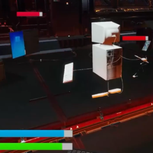

Computer Game
===========

    

## Project Concept

This third person combat adventurer is inspired by God of War. The focus of this game is it's combat and varying enemy types. The player embodies a desktop computer come to life as it embarks on a journey of revenge and proving self-worth. The player encounters different enemies in the form of modern technology and must defeat them while choosing the upgrades to elevate it's own performance. The project was conceptualized and built to learn Unreal Engine and experiment with Enemy AI.

## Table Of Contents

- [Snapshots](#Snapshots)
- [Getting Started](#getting-started)
    + [1. Setup-Unreal](#1-Setup-Unreal)
    + [2. Play The Game](#2-play-The-Game)
- [My Roles and Responsibilities](#my-roles-and-responsibilities)
- [Contact](#Contact)

## Snapshots

#### Computer Game

Below are some screenshots of the game:

## Getting Started

### 1. Setup Unreal

The Unreal Engine is required. Download it from <a href="https://www.unrealengine.com/en-US">Get Unreal Engine</a>.

### 2. Play The Game

**Standalone Build Play Session**
1. Open the project in Unreal Engine
2. Play in editor or build for your OS and run standalone

Enjoy!

## Contact

* Siddharth Singhai - sidsinghai97@gmail.com
* [![LinkedIn][linkedin-shield]][linkedin-url]
* [![Portfolio][portfolioIcon-url]][portfolio-url]

[linkedin-shield]: https://img.shields.io/badge/-LinkedIn-black.svg?style=for-the-badge&logo=linkedin&colorB=555
[linkedin-url]: https://www.linkedin.com/in/siddharthsinghai97/
[portfolioIcon-url]: https://img.shields.io/badge/-Portfolio-brightgreen
[portfolio-url]: https://sidoku.github.io
